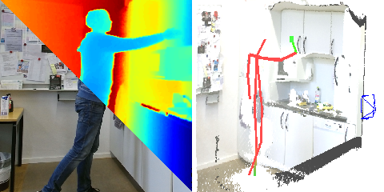

# 3D Human Pose Estimation in RGBD Images for Robotic Task Learning

This is a ROS node wrapping the approach presented in our paper for estimating 3D Human Pose from a single RGB-D frame. See the [project page](https://lmb.informatik.uni-freiburg.de/projects/rgbd-pose3d/) for additional information.

## Requirements

- Tested with ROS Indigo under Ubuntu 14.04
- Make sure you have installed the [cv_bridge](http://wiki.ros.org/cv_bridge) package
- Our node relies on warped depth maps as input, we recommend to use [iai_kinect](https://github.com/code-iai/iai_kinect2)
- Get [Tensorflow](https://www.tensorflow.org/install/install_linux) with gpu support for python2.7
- sudo pip install numpy Pillow scipy numpy opencv-python matplotlib

If you want to use our approach without ROS we refer to `forward_pass.py`, which applies our approach to the data we provide.

## Installation guide

- Make sure you fulfill the requirements 
- Clone this repository
- Download the [weights](https://lmb.informatik.uni-freiburg.de/projects/rgbd-pose3d/weights.zip) (~550 MB) and unzip them into the folder you cloned the repository to. Afterwards there should be a subdirectory `./weights/` containing a `*.pkl` file and two directories with Tensorflow snapshot models.
- Run `python2.7 forward_pass.py`. If it fails there is a problem that is not ROS related (Tensorflow, Other python packages, weights missing, Cuda, GPU, ... )
- Start the ROS node with `python2.7 RosNode.py`. For analyzing the predictions we recommend RViz. 

## Node description
 
The node subscribes to the following topics (given with its default values):

    COLOR_IMAGE_TOPIC = "/kinect2/qhd/image_color"  # undistorted color image of the camera
    DEPTH_MAP_TOPIC = "/kinect2/qhd/image_depth_rect"  # depth map warped into the color frame
    CAMERA_INFO_TOPIC = '/kinect2/qhd/camera_info'  # ROS topic containing camera calibration K and camera frame
    
and publishes the detected poses as:

    MarkerArray with topic "/human_pose" 
    tf.transform with frames "/human_pose/personX/Y"  with X=PERSON_ID Y=KEYPOINT_NAME
     
Its possible to modify the topic names in the top of `RosNode.py`. 
Please not that we only set the location of Tf.transform and leave the orientation unset.

In order to start the node simply run

    python2.7 RosNode.py
    
    
## Citation
If the node helps your research we welcome you to cite our work:

	@InProceedings{zw2018,
      author    = {Christian Zimmermann, Tim Welschehold, Christian Dornhege, Wolfram Burgard and Thomas Brox},
      title     = {3D Human Pose Estimation in RGBD Images for Robotic Task Learning},
      booktitle    = "IEEE International Conference on Robotics and Automation (ICRA)",
      year      = {2018},
      url          = "https://lmb.informatik.uni-freiburg.de/projects/rgbd-pose3d/"
    }

## Maintainers
If you have trouble with the node file an issue or contact:

- [Tim Welschehold](http://www2.informatik.uni-freiburg.de/~twelsche/), Autonomous Intelligent Systems, University of Freiburg
- [Christian Zimmermann](https://lmb.informatik.uni-freiburg.de/people/zimmermc/), Pattern Recognition and Image Processing, University of Freiburg
     

